# Cinematic Composition Rules Reference

Composition is the organization of subjects, negative space, lines, depth, scale, and visual weight inside the frame. Use a rule to direct attention and express spatial or emotional meaning; treat the rules as flexible tools rather than mandatory formulas.

## Composition Prompt Formula

`composition rule` + `subject placement and scale` + `foreground/middle/background structure` + `leading lines or geometry` + `negative space and visual weight` + `camera angle and aspect ratio` + `story purpose`.

## Rules With Local Graphics

### Rule of Thirds

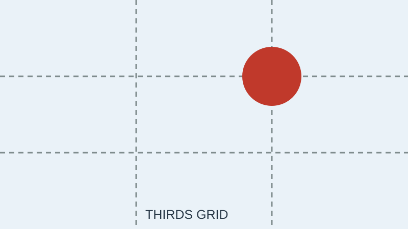

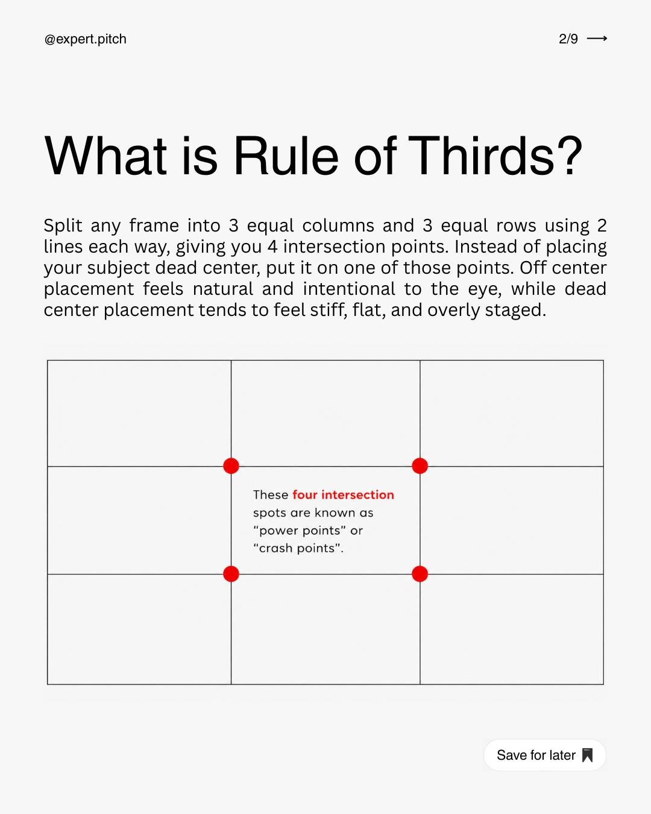

Place the primary subject or horizon near a thirds intersection or dividing line. Leave directional space for gaze or movement.

**Prompt:** `Compose using the rule of thirds, place the subject on the left or right third, reserve directional negative space, align the horizon deliberately, balanced cinematic framing.`

### Golden Ratio

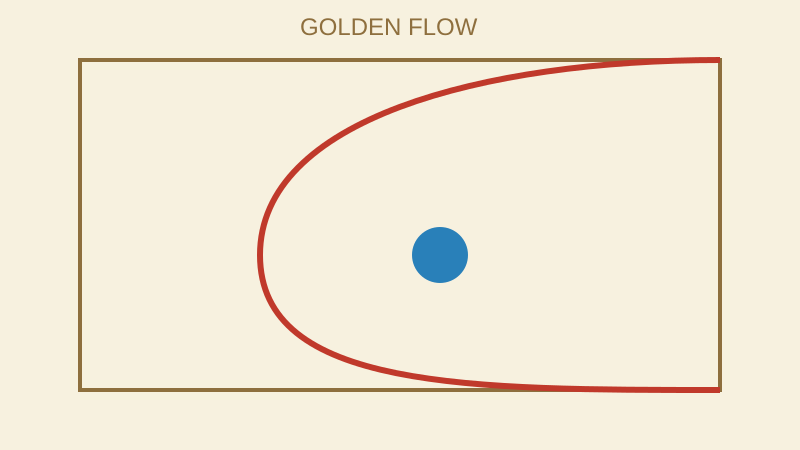

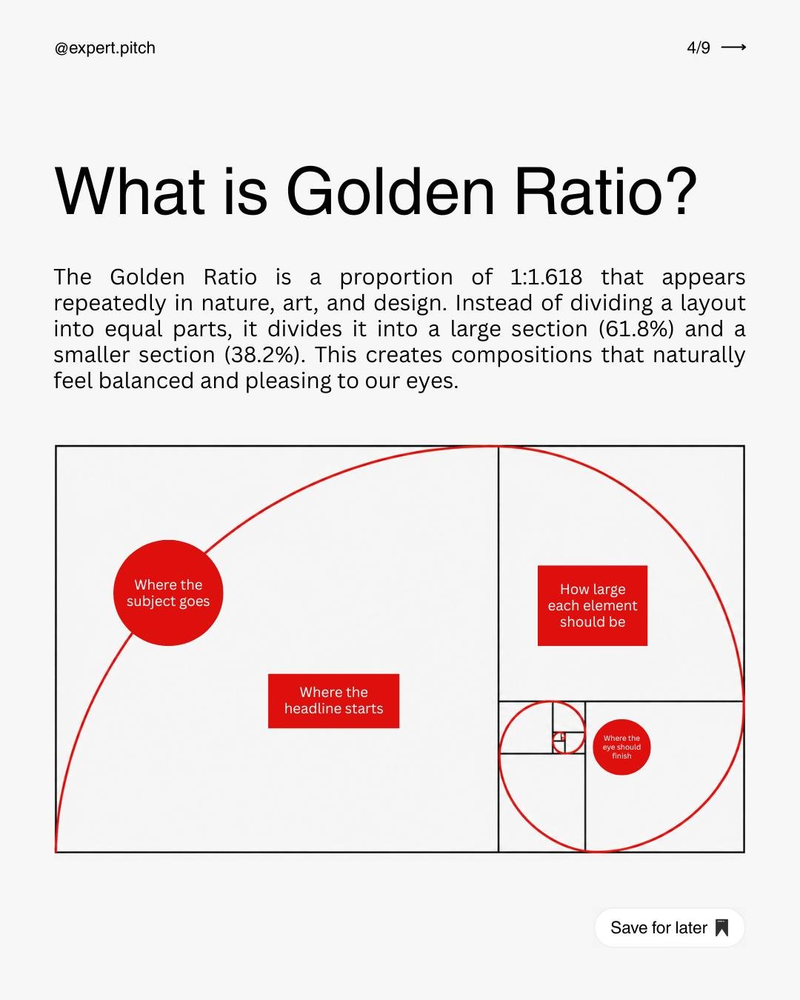

Arrange the dominant subject and supporting visual path along a proportional spiral or golden-section flow.

**Prompt:** `Use golden-ratio composition, place the subject at the visual convergence point, guide the eye through a curved proportional flow, elegant layered framing, controlled negative space.`

### Centered Composition

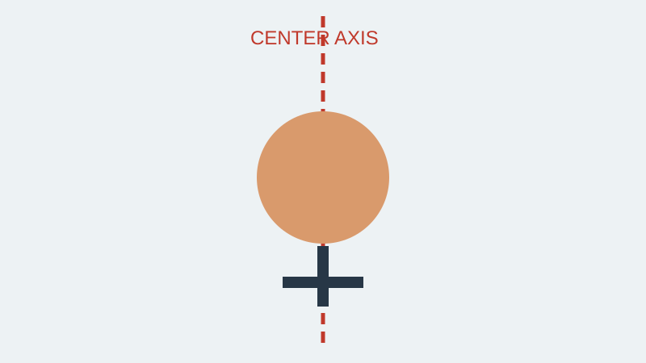

Place the main subject on the central vertical axis when authority, ritual, confrontation, symmetry, or iconic stillness is desired.

**Prompt:** `Use centered cinematic composition, subject aligned to the vertical axis, deliberate symmetry, stable horizon, controlled headroom, iconic stillness.`

### Symmetry

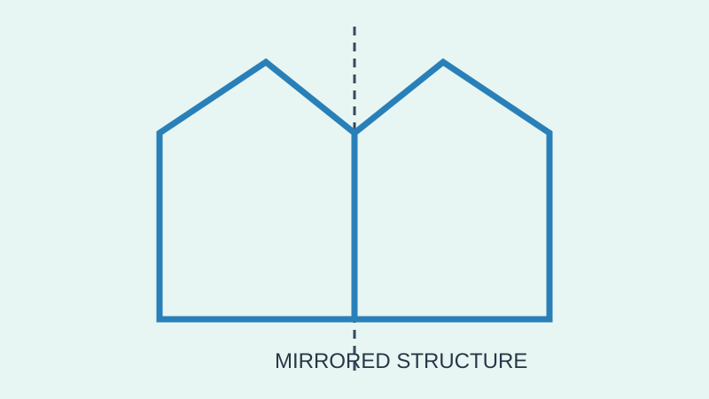

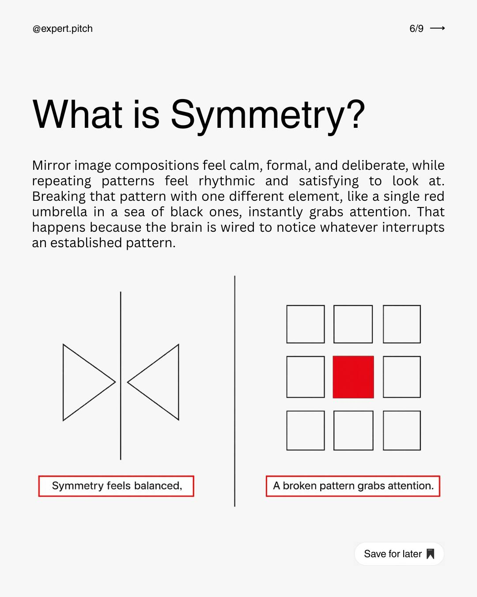

Mirror or balance the left and right sides of the frame through architecture, bodies, light, or repeated shapes.

**Prompt:** `Use strong bilateral symmetry, mirror the architecture and visual weight around the subject, centered perspective, precise geometry, restrained movement.`

### Asymmetry

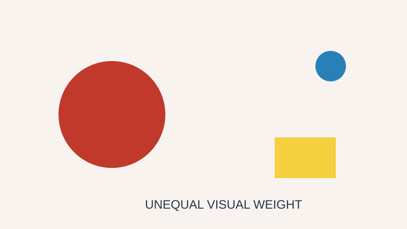

Use unequal visual weight, off-center placement, and deliberate imbalance to create tension, instability, or openness.

**Prompt:** `Use deliberate asymmetrical composition, place the subject off-center, counterbalance with a smaller distant element, preserve visual tension and intentional empty space.`

### Balance

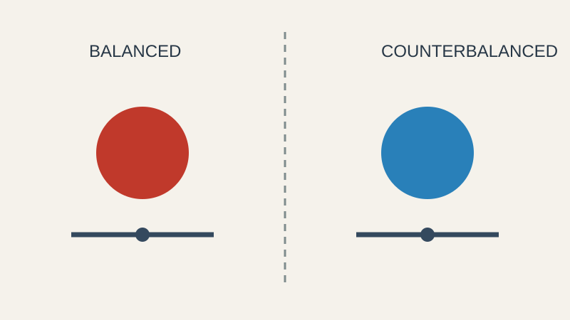

Distribute visual weight through size, contrast, color, texture, and position so the frame feels stable or intentionally unstable.

**Prompt:** `Balance the frame through subject scale, tonal contrast, color weight, and counterpoint objects; create stable visual equilibrium without flattening depth.`

### Visual Weight

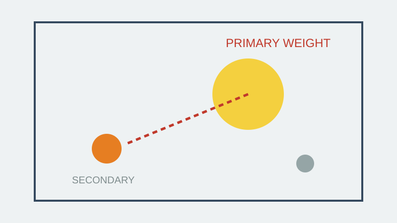

Control where attention lands by adjusting brightness, saturation, scale, sharpness, faces, contrast, and proximity to the frame edge.

**Prompt:** `Prioritize visual weight on the subject's face and hands through sharpness, contrast, and brightness; subordinate secondary elements with lower contrast and softer detail.`

### Leading Lines

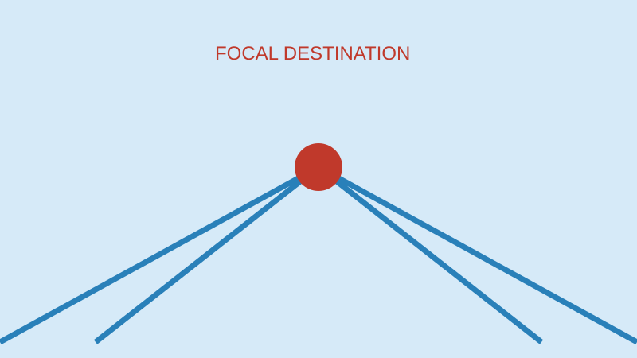

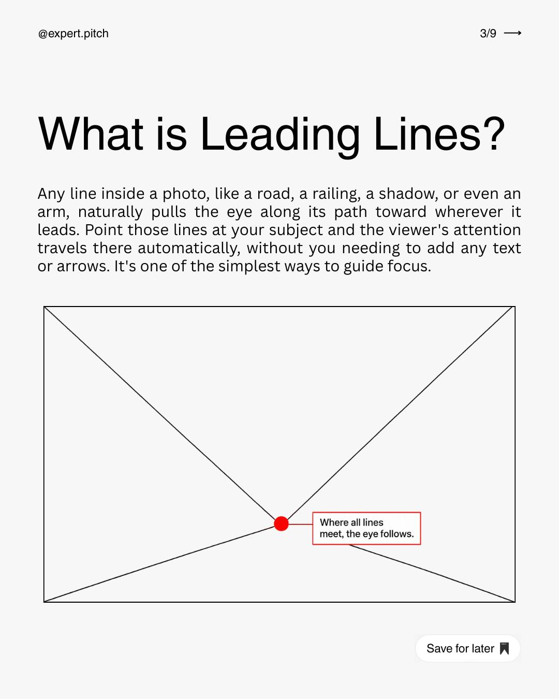

Use roads, rails, architecture, shadows, limbs, or perspective edges to lead the eye toward the subject or destination.

**Prompt:** `Use strong leading lines from the foreground toward the subject, converge architectural edges near the face, preserve depth and directional flow, cinematic perspective.`

### Diagonal Lines

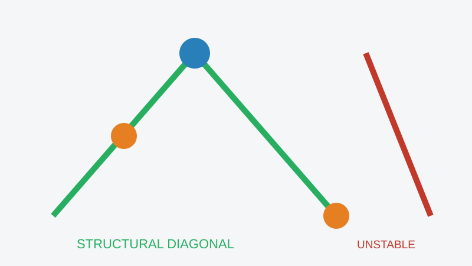

Diagonals create energy, instability, movement, hierarchy, or conflict across the frame.

**Prompt:** `Build the composition around strong diagonals, angle bodies and architecture through the frame, use directional tension and layered depth, avoid accidental imbalance.`

### S-Curve

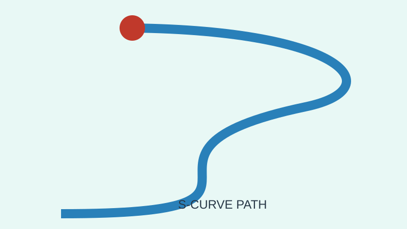

Use a winding path, body line, river, road, or visual sequence that guides the eye through an elegant curved route.

**Prompt:** `Use an S-curve composition to guide the eye from foreground to subject and into the background, graceful spatial rhythm, layered depth, controlled visual flow.`

### Triangular Composition

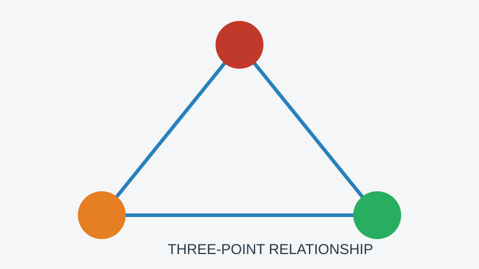

Arrange three subjects or visual anchors as a triangle to stabilize relationships, hierarchy, or conflict.

**Prompt:** `Arrange the three primary visual anchors as a clear triangle, use depth and eye-lines to define relationships, stable base, readable hierarchy, cinematic group blocking.`

### Rule of Odds

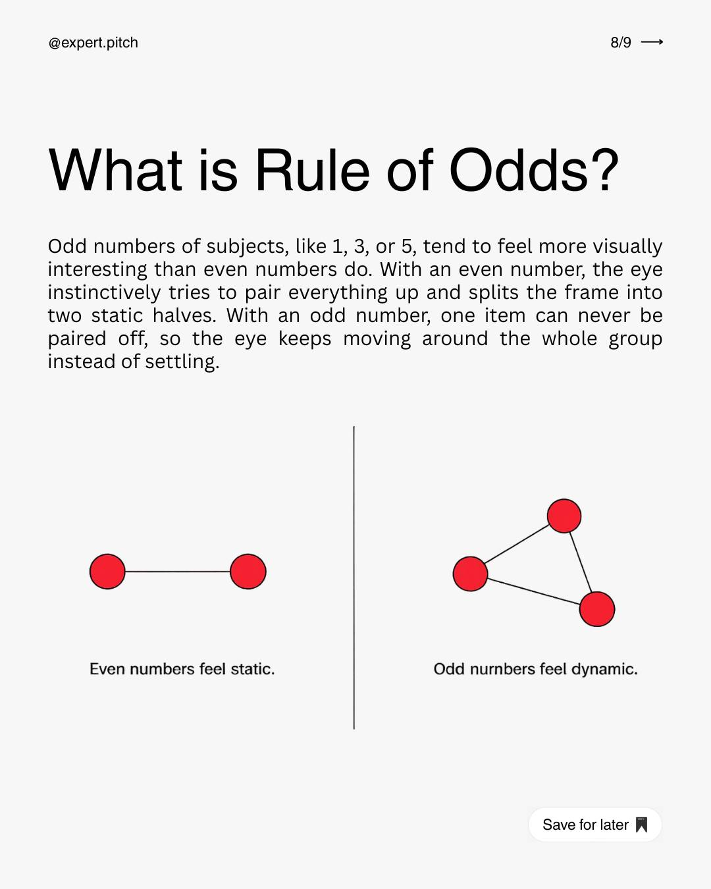

Odd-numbered groups often create a more natural focal hierarchy than evenly divided pairs.

**Prompt:** `Compose an odd-numbered group of three or five subjects, establish one dominant focal figure, vary depth and scale, maintain readable relationships.`

### Depth

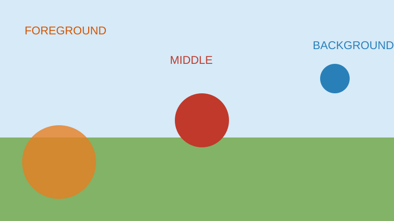

Separate foreground, middle ground, and background to create spatial volume and narrative layering.

**Prompt:** `Build strong cinematic depth with a soft foreground frame, sharply staged middle-ground subject, and readable background action; maintain clear spatial hierarchy.`

### Layering

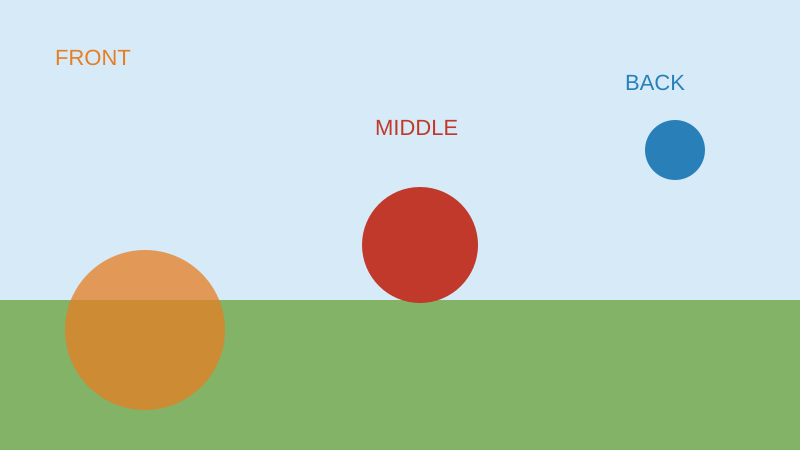

Place multiple visual events on different depth planes so the frame contains simultaneous information.

**Prompt:** `Use layered composition with distinct foreground, middle-ground, and background actions, preserve readable overlaps, let secondary information remain discoverable without competing with the subject.`

### Framing Within the Frame

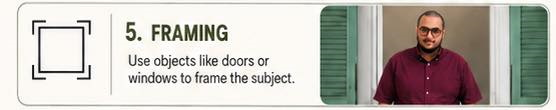

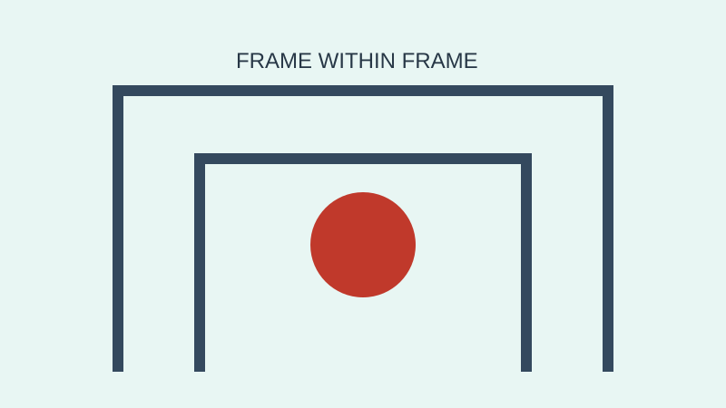

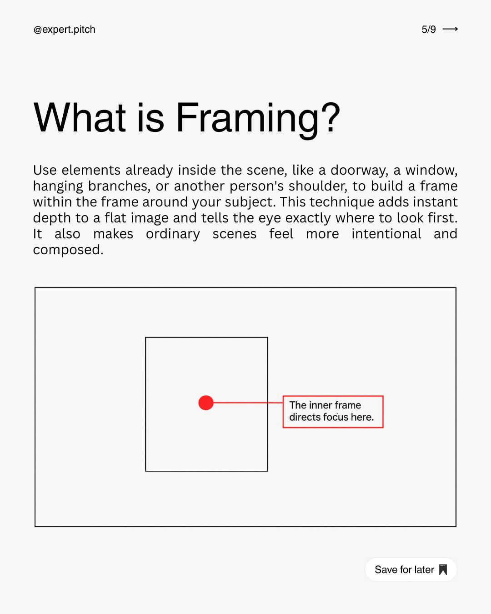

Use doors, windows, arches, branches, mirrors, or shadows to create a secondary frame around the subject.

**Prompt:** `Frame the subject within a natural architectural opening, use doorway or window edges to isolate attention, preserve depth beyond the frame, intentional foreground occlusion.`

### Negative Space

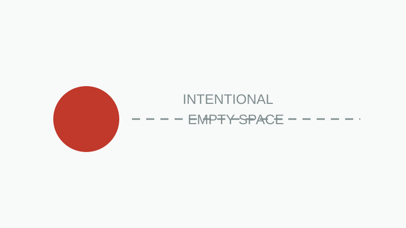

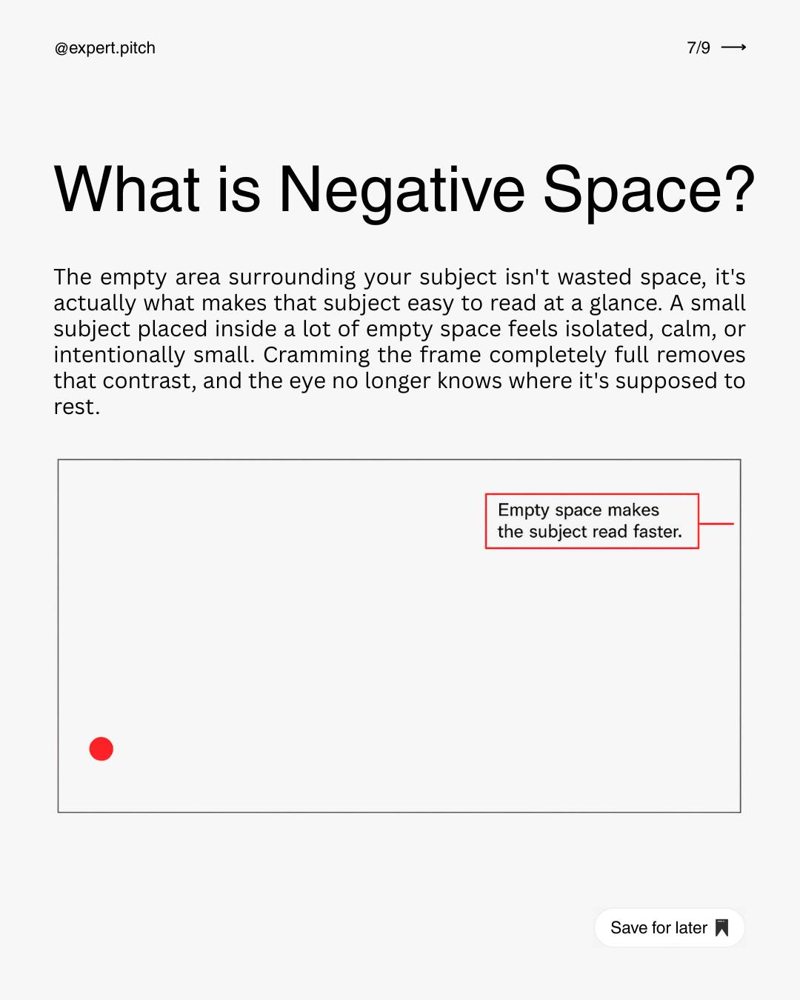

Leave controlled empty space around a subject to express solitude, anticipation, vulnerability, direction, or scale.

**Prompt:** `Use generous negative space on the subject's gaze or movement side, keep the subject small but readable, quiet background, intentional isolation, balanced tonal composition.`

### Minimalism

Reduce competing forms, colors, textures, and actions so one subject or gesture carries the frame.

**Prompt:** `Use minimalist composition with one dominant subject, restrained palette, uncluttered background, precise silhouette, generous breathing room, every remaining object intentional.`

### Fill the Frame

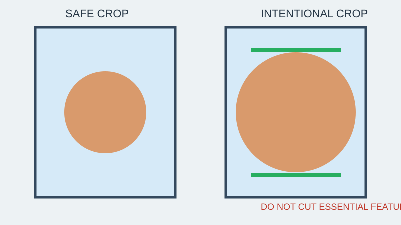

Allow the subject, texture, or action to press toward the frame edges, increasing intimacy, pressure, or sensory immersion.

**Prompt:** `Fill the frame with the subject, crop close to the edges without cutting essential features, emphasize texture and expression, high visual immediacy, minimal empty space.`

### Patterns

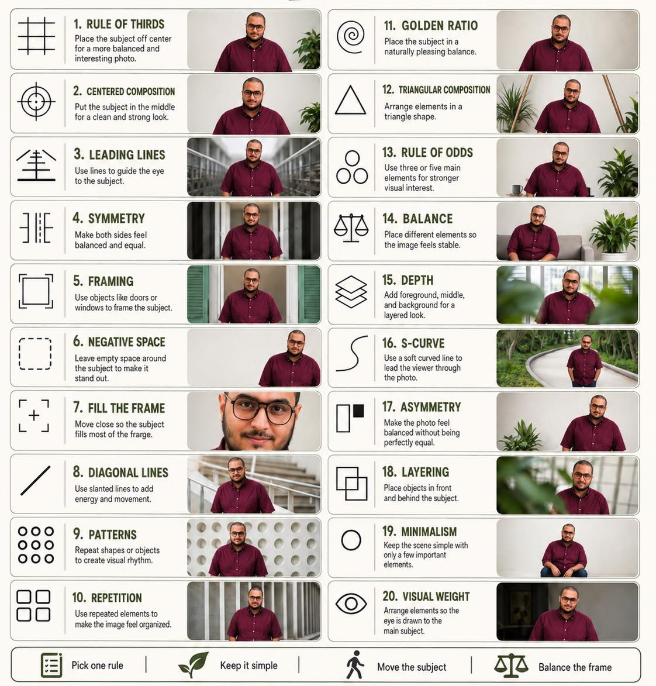

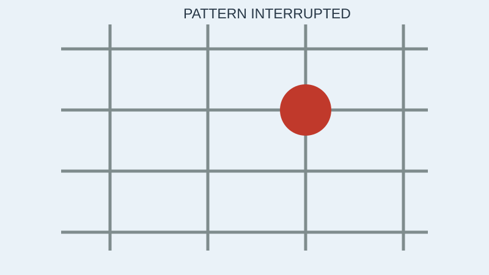

Use repeated visual forms, architecture, bodies, lights, or textures to create rhythm and expectation.

**Prompt:** `Use a repeating architectural or visual pattern across the frame, align the subject as a deliberate interruption or continuation, strong rhythm, controlled perspective.`

### Repetition

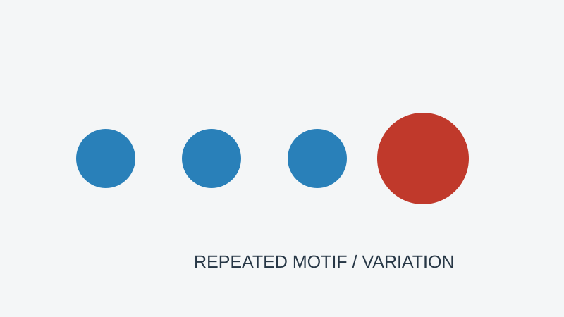

Repeat similar subjects, shapes, gestures, or colors to create emphasis, monotony, scale, or a visual motif.

**Prompt:** `Use repeated shapes or figures to establish a visual motif, vary one element subtly as the focal disruption, maintain consistent spacing and cinematic rhythm.`

### General Rules

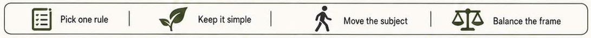

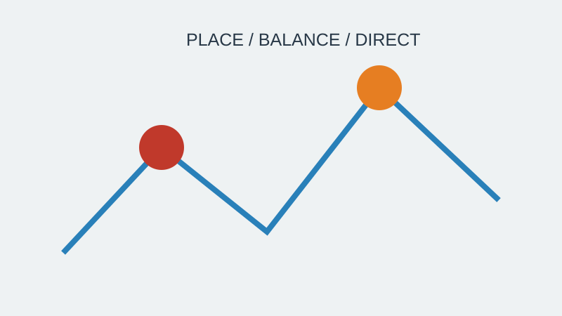

Use this graphic as a broad checklist for placement, balance, line, depth, and attention before selecting a more specific rule.

## Rules Formerly Missing From The Folder

The following rules were formerly absent from the folder. They now have definitions, prompt guidance, and local explanatory diagrams in this guide.

| Status                       | Composition rule                   | What is missing                                    | Prompt seed                                                                                                                                              |
| ---------------------------- | ---------------------------------- | -------------------------------------------------- | -------------------------------------------------------------------------------------------------------------------------------------------------------- |
| Added definition and graphic | Headroom and lead room             | Definition, prompt, and local diagram added below. | `Maintain intentional headroom and generous lead room in the direction of gaze or movement; do not crowd the subject.`                                   |
| Added definition and graphic | Look room / nose room              | Definition, prompt, and local diagram added below. | `Place the subject with clear look room in front of the eyes and face, preserve directional psychological space.`                                        |
| Added definition and graphic | Horizon line placement             | Definition, prompt, and local diagram added below. | `Place the horizon deliberately at the lower third, upper third, or level with the subject's eyes; keep it intentional.`                                 |
| Added definition and graphic | Eye-line match                     | Definition, prompt, and local diagram added below. | `Align eyelines across the composition to establish a clear spatial relationship; use a deliberate mismatch only for disorientation.`                    |
| Added definition and graphic | Screen direction / 180-degree axis | Definition, prompt, and local diagram added below. | `Maintain the 180-degree axis and consistent screen direction; cross the line only as a motivated psychological rupture.`                                |
| Added definition and graphic | Size contrast / scale hierarchy    | Definition, prompt, and local diagram added below. | `Create a clear scale hierarchy: dominant foreground subject, smaller distant figure, intentional power relationship.`                                   |
| Added definition and graphic | Figure-ground separation           | Definition, prompt, and local diagram added below. | `Separate the subject from the background through tonal contrast, edge light, color contrast, or depth of field; keep the silhouette readable.`          |
| Added definition and graphic | Open and closed composition        | Definition, prompt, and local diagram added below. | `Use an open composition with elements entering and leaving the frame, or a closed composition that contains all visual information within the borders.` |
| Added definition and graphic | Tangent control                    | Definition, prompt, and local diagram added below. | `Avoid distracting tangents where architecture or props touch the subject's silhouette; maintain clean visual separation.`                               |
| Added definition and graphic | Chiaroscuro composition            | Definition, prompt, and local diagram added below. | `Compose through a deliberate light-dark structure, place the subject in the controlled zone of illumination, use shadow as negative space.`             |

## Additional Graphics Added For Previously Under-Illustrated Rules

These concepts already had entries but lacked dedicated local graphics. The following explanatory diagrams have now been added:

- **Balance:** symmetrical and counterbalanced visual weight comparison. 
- **Visual weight:** primary and secondary attention-weight map. 
- **Depth:** combined foreground, middle-ground, and background planes. 
- **Centered composition:** center line and vanishing-point overlay. 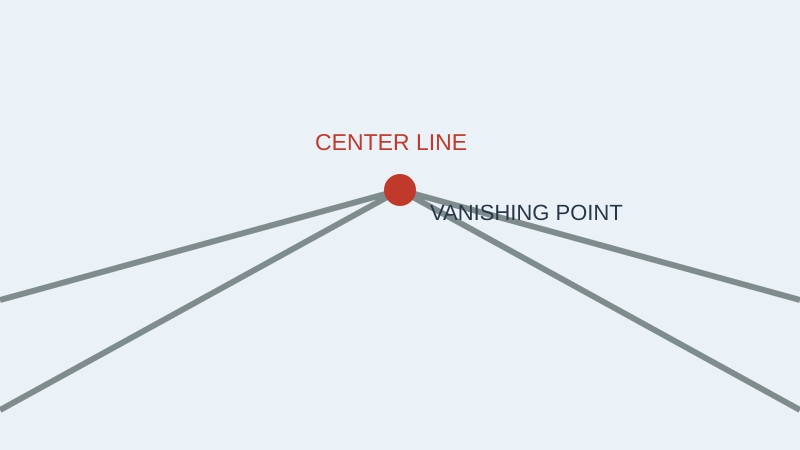
- **Diagonal lines:** constructive structural diagonal versus unstable diagonal. 
- **Fill-the-frame:** safe crop versus intentional close crop. 

## Definitions And New Graphics For Previously Missing Rules

### Headroom And Lead Room

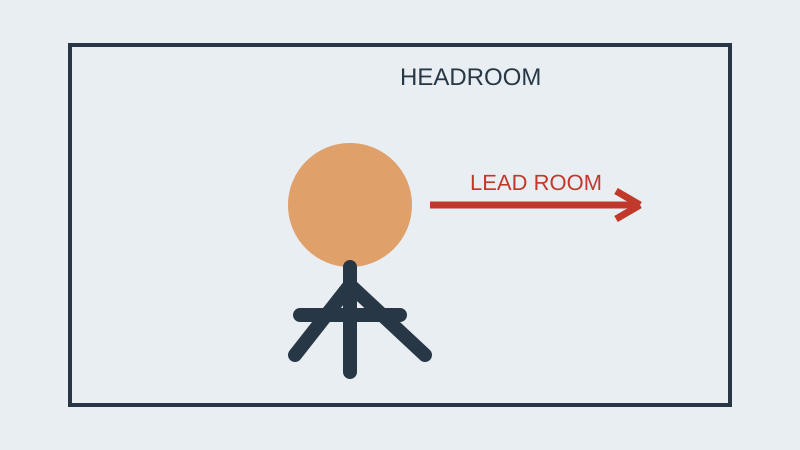

**Headroom** is the intentional space between the top of a subject's head and the upper frame edge. **Lead room** is the space in front of a subject's gaze or movement. Too little headroom feels cramped; too little lead room makes a moving or looking subject appear blocked.

**Prompt:** `Maintain intentional headroom above the head and generous lead room in the direction of gaze or movement; keep the subject comfortably inside the frame without crowding.`

### Look Room / Nose Room

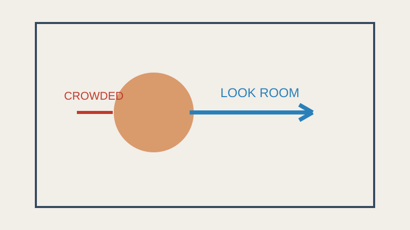

Look room, also called nose room, is the visual space placed in front of a person's face and gaze. It gives the viewer a destination for the character's attention and prevents the face from pressing into the frame edge.

**Prompt:** `Place the subject with clear look room in front of the eyes and nose, preserve directional psychological space, and avoid crowding the face against the frame edge.`

### Horizon Line Placement

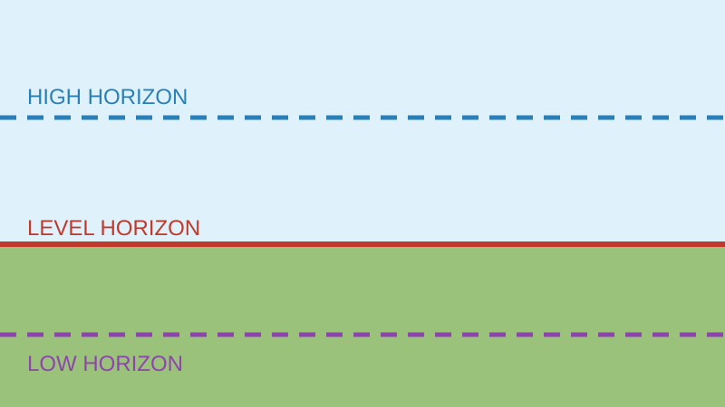

The horizon line controls the balance between sky and ground and can alter perceived scale, stability, and power. A high horizon emphasizes the ground or foreground; a low horizon gives the sky and subject more grandeur; a tilted horizon introduces instability.

**Prompt:** `Place the horizon deliberately at the upper third, lower third, or eye level according to the story; keep it level for stability or intentionally tilted for disorientation.`

### Eye-Line Match

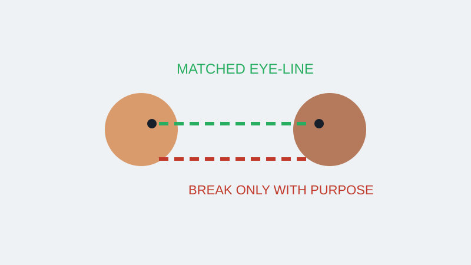

An eye-line match aligns the apparent gaze direction between characters or between a character and an offscreen object. It establishes spatial relationship; a broken or mismatched eye-line can create confusion, alienation, or deliberate psychological rupture.

**Prompt:** `Align the characters' eye-lines across the composition to establish a clear spatial relationship; use a deliberate mismatch only to create disorientation or emotional separation.`

### Screen Direction / 180-Degree Axis

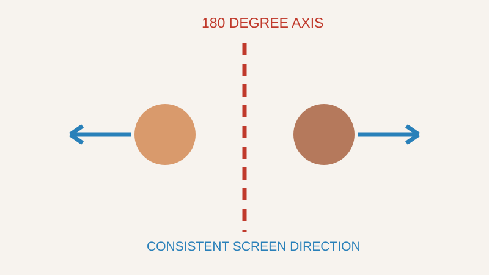

The 180-degree rule keeps the camera on one side of an implied action axis so subjects maintain consistent screen direction. Crossing the axis reverses positions and can confuse geography unless the crossing is shown or deliberately motivated.

**Prompt:** `Maintain the 180-degree axis and consistent screen direction across the shot sequence; cross the line only through a visible camera move or a motivated psychological rupture.`

### Size Contrast / Scale Hierarchy

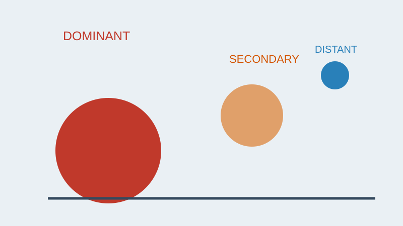

Scale hierarchy uses relative size, distance, and framing to establish importance, power, intimacy, or social distance. A dominant foreground figure can overpower a smaller background figure without dialogue.

**Prompt:** `Create a clear scale hierarchy with a dominant foreground subject, a secondary mid-ground figure, and a smaller distant figure; use size and distance to express power and relationship.`

### Figure-Ground Separation

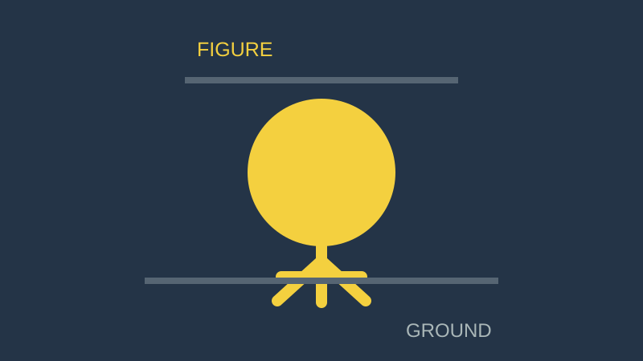

Figure-ground separation makes the primary subject readable against its environment through contrast, edge light, color difference, depth of field, silhouette, or simplified background detail.

**Prompt:** `Separate the subject from the background through tonal contrast, edge light, color contrast, silhouette, and depth of field; keep the figure immediately readable without a cutout effect.`

### Open And Closed Composition

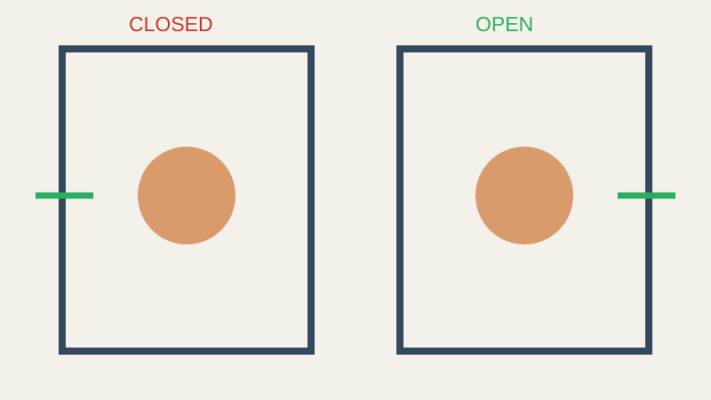

An **open composition** suggests that the world continues beyond the frame, often allowing subjects or movement to enter and leave. A **closed composition** contains the important information within the borders and can feel controlled, trapped, complete, or self-contained.

**Prompt:** `Choose an open composition with elements entering or leaving the frame for expansion and uncertainty, or a closed composition that contains the visual information for control and confinement.`

### Tangent Control

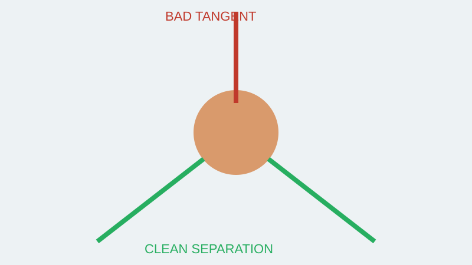

A tangent occurs when a line, edge, prop, or another body appears to touch or merge awkwardly with a subject's head, limbs, or silhouette. Tangents flatten depth and create accidental visual confusion.

**Prompt:** `Audit the frame for tangents; keep architecture, props, and background lines from touching the subject's head or limbs accidentally, using clean separation or deliberate overlap only.`

### Chiaroscuro Composition

Chiaroscuro composition uses the geometry of light and shadow to establish hierarchy. The illuminated zone attracts attention while shadow becomes negative space, concealment, or a competing emotional force.

**Prompt:** `Compose through a deliberate light-dark structure, place the primary subject in the controlled zone of illumination, use shadow as negative space, and preserve readable tonal hierarchy.`

## Practical Selection Guide

| Story objective           | Start with                                                     |
| ------------------------- | -------------------------------------------------------------- |
| Authority or ritual       | Centered composition, symmetry, visual weight                  |
| Vulnerability or solitude | Negative space, asymmetry, small scale, depth                  |
| Movement or danger        | Diagonal lines, leading lines, S-curve, fill the frame         |
| Relationship and conflict | Triangular composition, eye-line match, layering, rule of odds |
| Discovery or revelation   | Framing within frame, depth, background layers, golden ratio   |
| Calm or contemplation     | Balance, minimalism, centered composition, open space          |
| Crowds or social systems  | Patterns, repetition, rule of odds, layering                   |

## Hard Negatives

`No accidental tangents, no clipped faces or hands unless intentional, no empty space on the wrong side of gaze or motion, no competing focal points, no broken screen direction, no horizon intersecting the subject awkwardly, no arbitrary rule application without story purpose.`
