# FACS Cheat Sheet

Visual reference for the Facial Action Coding System (FACS): Action Units (AUs), Action Descriptors (ADs), primary anatomy, and observable motion.

> Source and image credit: [Melinda Ozel, FACS Cheat Sheet](https://melindaozel.com/facs-cheat-sheet/). The 41 source images available during extraction are stored locally in [images](images). Two source image URLs returned HTTP 404 and are marked below. This is a compact working reference, not a replacement for formal FACS training or the FACS Manual.

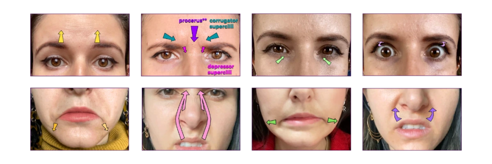

## Forehead And Ears

| Code     | Action            | Primary muscle(s)                                     | Observable movement                                               |
| -------- | ----------------- | ----------------------------------------------------- | ----------------------------------------------------------------- |
| AU1      | Inner brow raiser | Frontalis, medial portion                             | Raises the medial brow and central forehead.                      |
| AU2      | Outer brow raiser | Frontalis, lateral portion                            | Raises the lateral brow and outer forehead.                       |
| AU4      | Brow lowerer      | Corrugator supercilii, depressor supercilii, procerus | Knits and lowers the brow; compresses the central lower forehead. |
| not FACS | Ears up and back  | Superior and posterior auricular muscles              | Lifts and draws the ears rearward.                                |

| AU1                                                              | AU2                                                              | AU4                                                                               | Ears up and back                                            |
| ---------------------------------------------------------------- | ---------------------------------------------------------------- | --------------------------------------------------------------------------------- | ----------------------------------------------------------- |
| 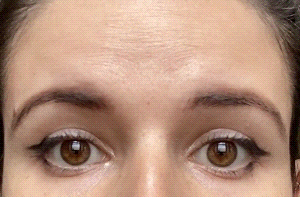 | 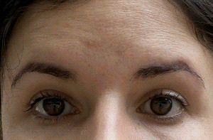 | 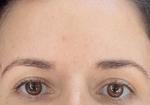 | 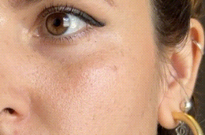 |

## Eye And Cheek Area

| Code     | Action           | Primary muscle(s)                              | Observable movement                                      |
| -------- | ---------------- | ---------------------------------------------- | -------------------------------------------------------- |
| AU5      | Upper lid raiser | Levator palpebrae superioris                   | Pulls the upper lids up and back, widening the eyes.     |
| AU6      | Cheek raiser     | Orbicularis oculi, orbital portion             | Raises cheeks and compresses the outer eye area.         |
| AU7      | Lid tightener    | Orbicularis oculi, preseptal palpebral portion | Narrows the lid opening with tension around the eyelids. |
| not FACS | Open-eyed blink  | Orbicularis oculi, pretarsal portion           | Circular eyelid tightening without a full eye closure.   |
| AU45     | Blink            | Orbicularis oculi, pretarsal portion           | Swiftly closes and reopens both eyes.                    |
| AU46     | Wink             | Orbicularis oculi                              | Closes one eye, often with compression.                  |

| AU5                                                           | AU6                                                   | AU7                                                     | Open-eyed blink                                            | AU45                                           | AU46                           |
| ------------------------------------------------------------- | ----------------------------------------------------- | ------------------------------------------------------- | ---------------------------------------------------------- | ---------------------------------------------- | ------------------------------ |
| 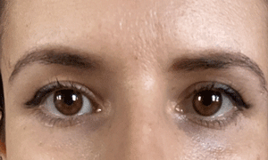 | 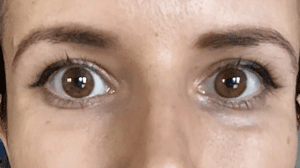 | 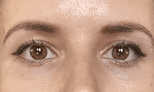 | 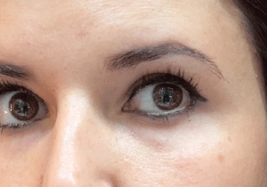 | 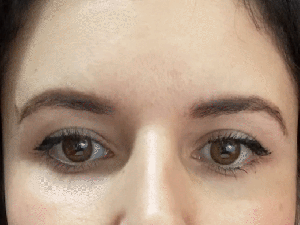 | 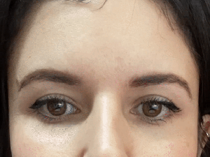 |

## Middle Face And Nasolabial Area

| Code | Action                     | Primary muscle(s)                                     | Observable movement                                             |
| ---- | -------------------------- | ----------------------------------------------------- | --------------------------------------------------------------- |
| AU9  | Nose wrinkler              | Levator labii superioris alaeque nasi                 | Raises the nasal sides, nostrils, and central upper-lip region. |
| AU10 | Upper lip raiser           | Levator labii superioris                              | Lifts the upper lip, more lateral than AU9.                     |
| AU11 | Nasolabial furrow deepener | Zygomaticus minor                                     | Lifts and stretches the upper lip laterally and obliquely.      |
| AU38 | Nostril dilator            | Dilator naris, alar portion of nasalis                | Widens the nostril wings.                                       |
| AU39 | Nostril compressor         | Compressor naris, transverse nasalis; depressor septi | Narrows the nostril wings; may lower the nasal tip.             |

| AU9                                                                                 | AU10                                                                                        | AU11                                                                                                            | AU38                                                     | AU39                                                           |
| ----------------------------------------------------------------------------------- | ------------------------------------------------------------------------------------------- | --------------------------------------------------------------------------------------------------------------- | -------------------------------------------------------- | -------------------------------------------------------------- |
| 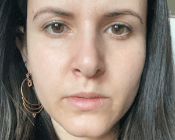 | 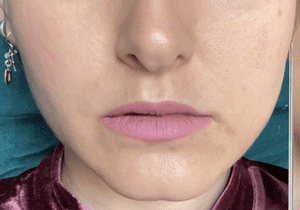 | 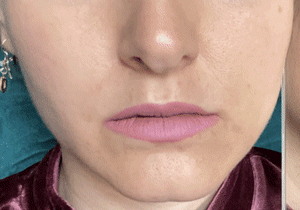 | 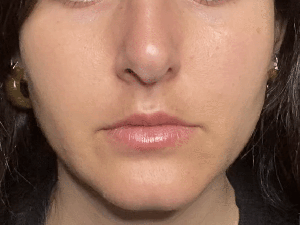 | 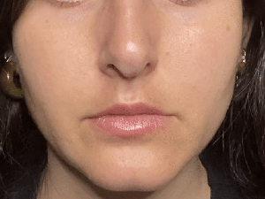 |

## Lip Corner Movers

| Code | Action               | Primary muscle(s)                         | Observable movement                                                                   |
| ---- | -------------------- | ----------------------------------------- | ------------------------------------------------------------------------------------- |
| AU12 | Lip corner puller    | Zygomaticus major                         | Draws lip corners up, back, and laterally.                                            |
| AU13 | Sharp lip puller     | Levator anguli oris                       | Draws lip corners upward.                                                             |
| AU14 | Dimpler              | Buccinator                                | Pinches corners vertically (y-axis) and/or draws them back toward the teeth (z-axis). |
| AU15 | Lip corner depressor | Depressor anguli oris                     | Draws lip corners downward.                                                           |
| AU18 | Lip pucker           | Incisivus labii superioris and inferioris | Draws corners inward; lips gather centrally and protrude.                             |
| AU20 | Lip stretcher        | Risorius                                  | Pulls lip corners laterally and stretches the lips.                                   |

| AU12                                                                                          | AU14, y-axis                                                                    | AU14, z-axis                                       | AU15                                                                                           | AU18                                                                            | AU20                                                                                  |
| --------------------------------------------------------------------------------------------- | ------------------------------------------------------------------------------- | -------------------------------------------------- | ---------------------------------------------------------------------------------------------- | ------------------------------------------------------------------------------- | ------------------------------------------------------------------------------------- |
| 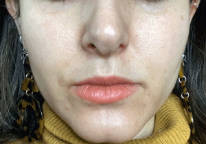 | 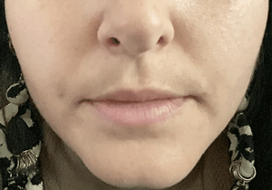 | 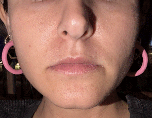 | 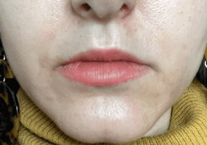 | 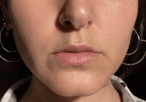 | 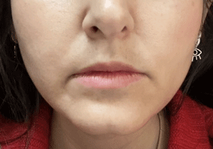 |

## Lower Lip And Chin

| Code | Action              | Primary muscle(s)          | Observable movement                       |
| ---- | ------------------- | -------------------------- | ----------------------------------------- |
| AU16 | Lower lip depressor | Depressor labii inferioris | Draws the lower lip down and laterally.   |
| AU17 | Chin raiser         | Mentalis                   | Raises and pushes the lower lip and chin. |

| AU16                                                                                              | AU17                                |
| ------------------------------------------------------------------------------------------------- | ----------------------------------- |
| 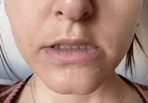 | Source image unavailable (HTTP 404) |

## Orbicularis Oris Actions

| Code | Action                 | Primary muscle(s)                                  | Observable movement                                                             |
| ---- | ---------------------- | -------------------------------------------------- | ------------------------------------------------------------------------------- |
| AU8  | Lips toward each other | Orbicularis oris                                   | Moves upper and lower lips together while the jaw may remain open.              |
| AU22 | Lip funneler           | Orbicularis oris, peripheral portion               | Projects lips forward and fans them outward.                                    |
| AU23 | Lip tightener          | Orbicularis oris, marginal portion                 | Horizontal form thins the lips; vertical lip cincher is a non-standard variant. |
| AU24 | Lip presser            | Orbicularis oris, marginal portion                 | Presses upper and lower lips together.                                          |
| AU28 | Lips suck              | Orbicularis oris, marginal and peripheral portions | Draws lips into the mouth around the teeth.                                     |

| AU8                                                  | AU22                                                                                | AU23, horizontal                                                                                            | AU23, vertical                                                                                          | AU24                                | AU28                                                                                           |
| ---------------------------------------------------- | ----------------------------------------------------------------------------------- | ----------------------------------------------------------------------------------------------------------- | ------------------------------------------------------------------------------------------------------- | ----------------------------------- | ---------------------------------------------------------------------------------------------- |
| 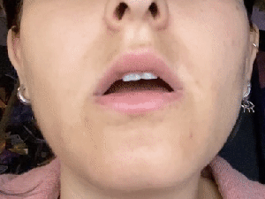 | 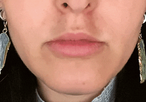 | 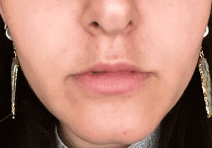 | 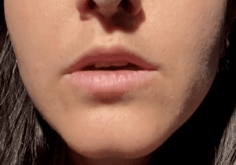 | Source image unavailable (HTTP 404) | 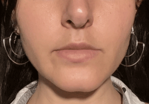 |

## Jaw Actions

| Code | Action        | Primary muscle(s)                                    | Observable movement                            |
| ---- | ------------- | ---------------------------------------------------- | ---------------------------------------------- |
| AU26 | Jaw drop      | Relaxation of masseter, temporalis, medial pterygoid | Lowers the jaw in a relaxed, unforced manner.  |
| AU27 | Mouth stretch | Lateral pterygoid and suprahyoids                    | Forcefully lowers the jaw.                     |
| AD29 | Jaw thrust    | Medial/lateral pterygoids, masseter                  | Pushes the lower jaw forward.                  |
| AD30 | Jaw sideways  | Medial/lateral pterygoids, temporalis                | Moves the lower jaw left or right.             |
| AU31 | Jaw clencher  | Temporalis, masseter, medial pterygoid               | Raises the jaw to press against the upper jaw. |

| AU26                                                                        | AD29                                                | AD30                                                    | AU31                                                    |
| --------------------------------------------------------------------------- | --------------------------------------------------- | ------------------------------------------------------- | ------------------------------------------------------- |
| 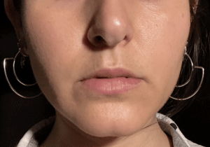 | 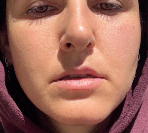 | 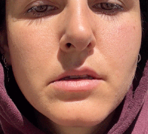 | 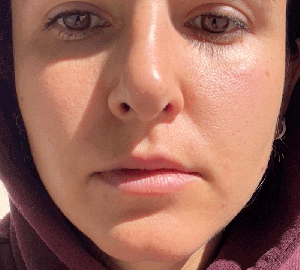 |

## Miscellaneous And Action Descriptors

| Code | Action         | Primary muscle(s) | Observable movement                                                |
| ---- | -------------- | ----------------- | ------------------------------------------------------------------ |
| AU21 | Neck tightener | Platysma          | Tenses the neck surface.                                           |
| AU25 | Lips part      | Varies            | A state where the lips are separated, not one fixed muscle action. |
| AD19 | Tongue show    | Varies            | Tongue becomes visible.                                            |
| AD32 | Bite           | Varies            | Teeth grip a lip or other soft tissue.                             |
| AD33 | Blow           | Varies            | Expels air through the mouth.                                      |
| AD34 | Puff           | Varies            | Inflates one or both cheeks.                                       |
| AD35 | Suck           | Varies            | Draws cheeks or soft tissue inward.                                |
| AD36 | Bulge          | Varies            | Pushes cheek tissue outward.                                       |
| AD37 | Lip wipe       | Varies            | Wipes or draws the lips across each other.                         |

| AU21                                                        | AU25                                                                                           | AD19                                                  | AD32                                 | AD33                                     | AD34                                          | AD35                                    | AD36                                      | AD37                                            |
| ----------------------------------------------------------- | ---------------------------------------------------------------------------------------------- | ----------------------------------------------------- | ------------------------------------ | ---------------------------------------- | --------------------------------------------- | --------------------------------------- | ----------------------------------------- | ----------------------------------------------- |
| 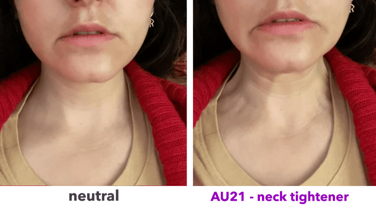 | 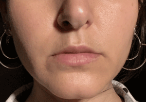 | 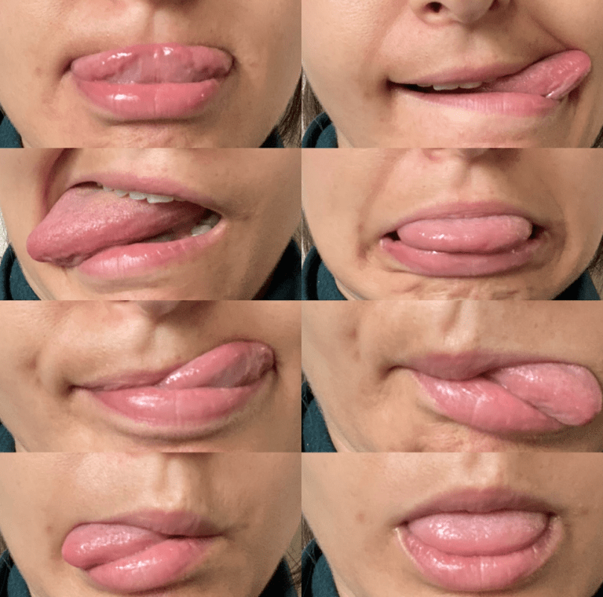 | 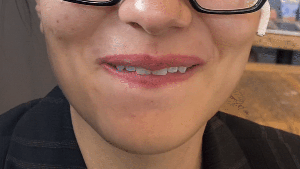 | 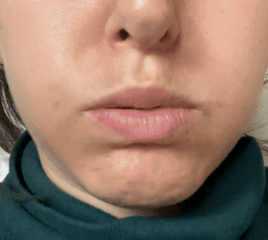 | 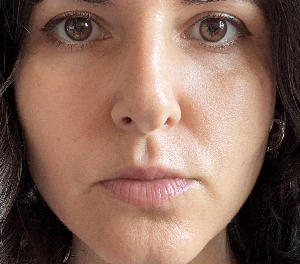 | 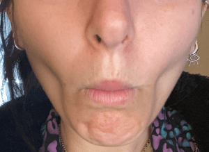 | 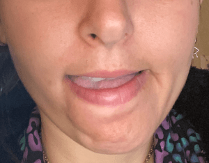 | 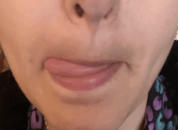 |

## FACS-To-Emotion Mapping

These are common **displayed-emotion** patterns, not a direct readout of a person's private emotional state. Interpret the full expression, timing, context, culture, and baseline alongside the AU combination.

| Displayed emotion | Signature AU combination                  | Component actions                                                                                     | iMotions visual components                                                                                                                                                                                                                                                                                                                                                                                                                        |
| ----------------- | ----------------------------------------- | ----------------------------------------------------------------------------------------------------- | ------------------------------------------------------------------------------------------------------------------------------------------------------------------------------------------------------------------------------------------------------------------------------------------------------------------------------------------------------------------------------------------------------------------------------------------------- |
| Happiness / joy   | AU6 + AU12                                | Cheek raiser + lip corner puller                                                                      | 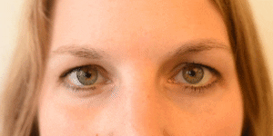 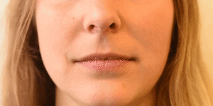                                                                                                                                                                                                                                                                                                                   |
| Sadness           | AU1 + AU4 + AU15                          | Inner brow raiser + brow lowerer + lip corner depressor                                               | 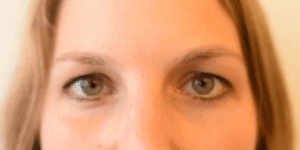 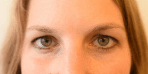 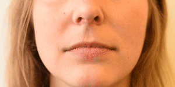                                                                                                                                                                                                                                         |
| Surprise          | AU1 + AU2 + AU5 + AU26                    | Inner brow raiser + outer brow raiser + upper lid raiser + jaw drop                                   |  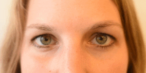 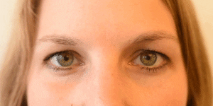 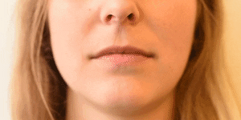                                                                                                                                                                                     |
| Fear              | AU1 + AU2 + AU4 + AU5 + AU7 + AU20 + AU26 | Inner/outer brow raisers + brow lowerer + upper lid raiser + lid tightener + lip stretcher + jaw drop |     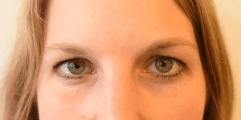   |
| Anger             | AU4 + AU5 + AU7 + AU23                    | Brow lowerer + upper lid raiser + lid tightener + lip tightener                                       |                                                                                                                                                                                                 |
| Disgust           | AU9 + AU15 + AU16                         | Nose wrinkler + lip corner depressor + lower lip depressor                                            |                                                                                                                                                                                                                                    |
| Contempt          | AU12 + AU14, unilateral                   | One-sided lip corner puller + dimpler                                                                 |                                                                                                                                                                                                                                                                                                                             |

**How to use it:** Treat the rows as starting hypotheses for facial analysis or animation. A partial, asymmetric, low-intensity, or brief version may indicate a related display without matching the full prototype.

Source: [iMotions, "Facial Action Coding System (FACS) - A Visual Guidebook"](https://imotions.com/blog/learning/research-fundamentals/facial-action-coding-system/), "Emotions and Action Units."

## Practical Reading Notes

- Treat AUs as independently controllable components, then read combinations and timing for expression rather than assigning a single emotion from one action.
- Distinguish AU6 from AU7 by the location of compression: AU6 engages the outer eye orbit and cheek; AU7 concentrates on the eyelids.
- Distinguish AU20 lip stretcher from AU27 mouth stretch: AU20 is lateral lip-corner movement, while AU27 is forced jaw lowering.
- On the source page, `not FACS` labels anatomically observed movements that are not formal FACS action units; AU23 vertical lip cincher and AU14 directional variants are examples of useful supplemental distinctions.

## Source Citation

Ozel, M. (2020, February). _FACS Cheat Sheet_. Face the FACS. https://melindaozel.com/facs-cheat-sheet/
