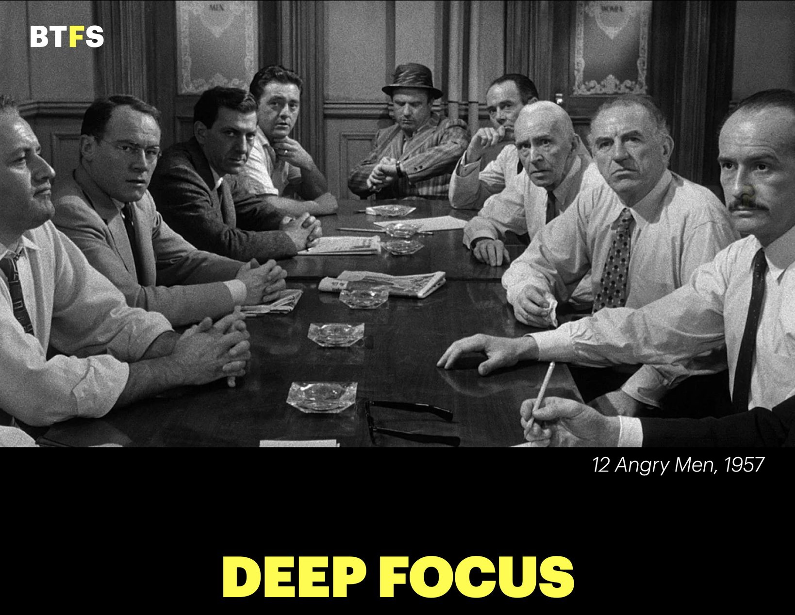
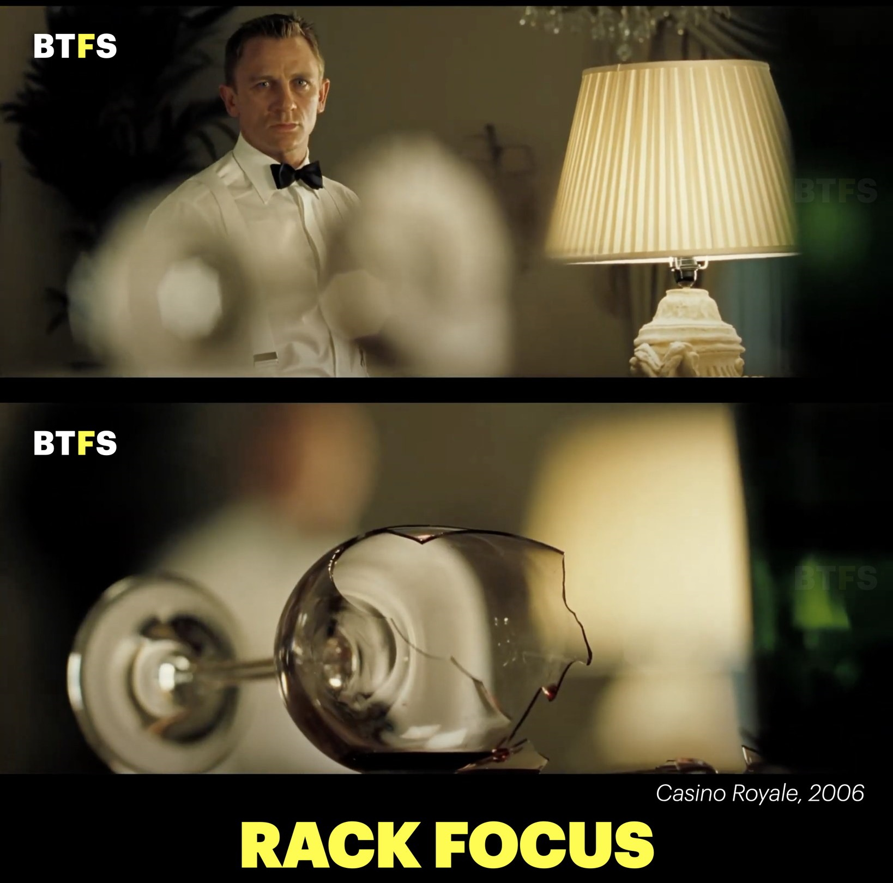
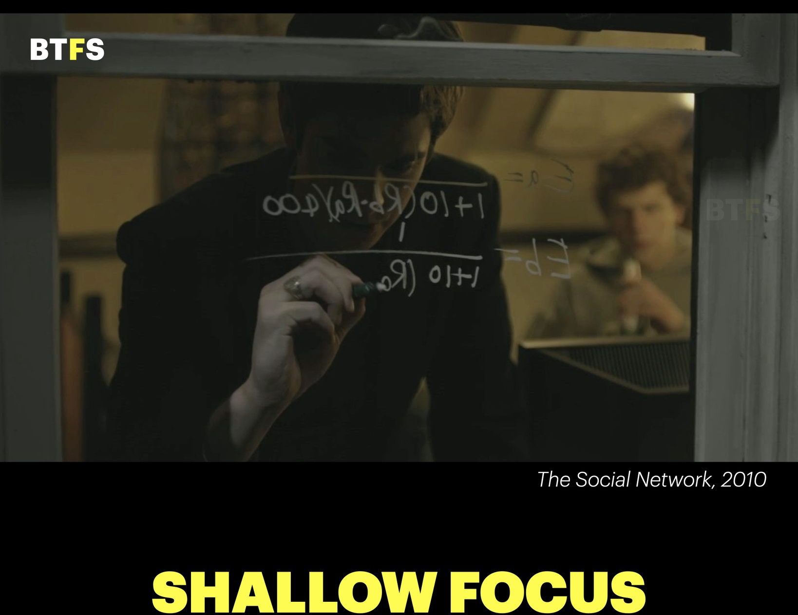
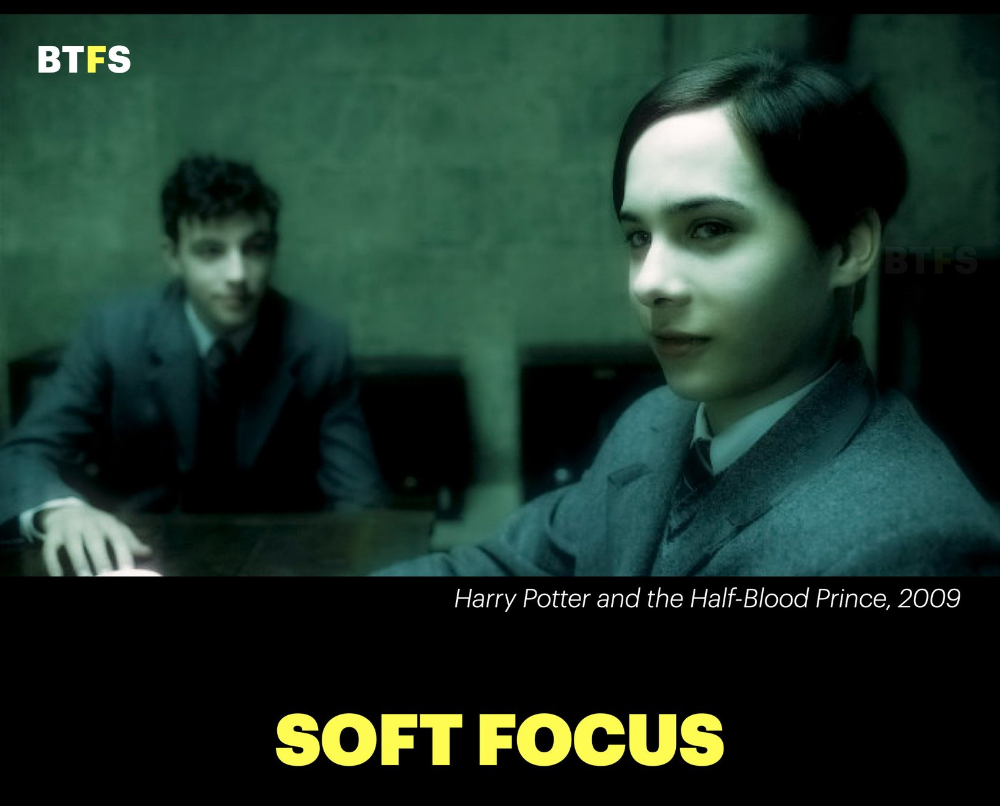
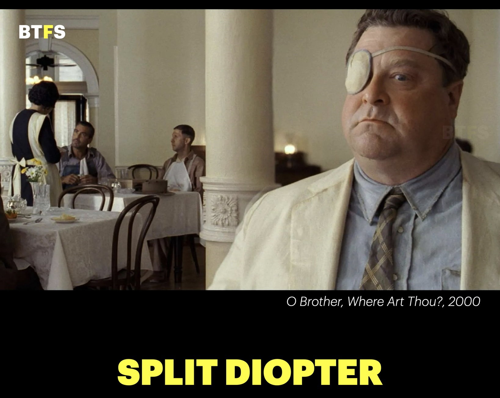
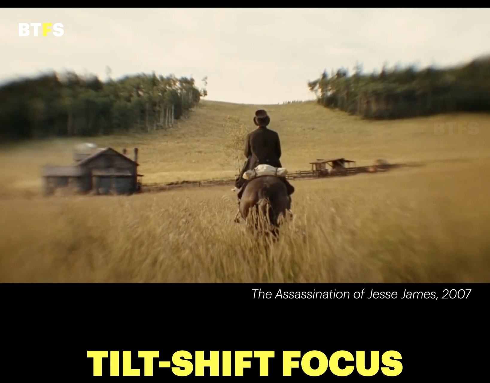

# Cinematic Focus Techniques

Use focus as a storytelling decision, not only as a camera setting. Focus controls what the audience notices, when attention moves, how much information remains available, and whether a moment feels intimate, objective, dreamlike, or unstable.

## Continuity Rules

- Choose the focus technique before writing the image or video prompt.
- State the subject that must be sharp, the elements that should be soft, and the intended transition when the focus changes during a shot.
- Keep character identity, framing, lens perspective, lighting, and background continuity stable when building a focus board.
- Do not describe every background element as blurred. Specify the depth layers that remain readable.
- For video, define the focus behavior: locked, drifting, pulling, breathing, searching, or deliberately unstable.

## Technique Reference

| Technique                  | What the viewer sees                                                                                                                        | Storytelling use                                                                                                         | Prompt direction                                                                                                                                                                                                |
| -------------------------- | ------------------------------------------------------------------------------------------------------------------------------------------- | ------------------------------------------------------------------------------------------------------------------------ | --------------------------------------------------------------------------------------------------------------------------------------------------------------------------------------------------------------- |
| Deep focus                 | Foreground, middle ground, and background remain sharply readable at the same time.                                                         | Lets the audience explore competing actions, relationships, and spatial details without being guided to one layer.       | `Use deep focus across foreground, subject, and background; keep all important planes sharply resolved, natural perspective, no artificial blur, controlled cinematic composition.`                             |
| Shallow focus              | One subject or narrow depth plane is sharp while nearby and distant elements fall into soft blur.                                           | Creates intimacy, isolates a character, reduces distractions, or makes a private thought feel separate from the world.   | `Use shallow depth of field; keep the character's eyes and intended focal plane razor sharp, render foreground and background as smooth optical blur with natural lens falloff.`                                |
| Rack focus / focus pull    | Sharpness deliberately transfers from one subject or depth layer to another during the shot.                                                | Redirects attention, reveals information, creates a connection between two subjects, or changes the meaning of a detail. | `Begin focused on [first subject], then execute a smooth deliberate focus pull to [second subject]; preserve framing and exposure, let the first subject fall naturally soft as the second becomes sharp.`      |
| Soft focus                 | The image has reduced micro-contrast and gentle definition while retaining an identifiable subject and overall form.                        | Suggests memory, romance, fantasy, fragility, nostalgia, glamour, or emotional distance.                                 | `Use a controlled soft-focus diffusion effect; retain recognizable facial features and readable eyes, soften fine detail and highlights, avoid haze that obscures the subject or produces a low-quality image.` |
| Split diopter              | Two subjects at significantly different distances are simultaneously sharp, while the area between them may show an unusual focus boundary. | Places two characters or ideas in visual conflict, connection, surveillance, or parallel awareness.                      | `Use a split-diopter look: keep the near subject and distant subject simultaneously sharp despite different distances, allow a subtle unnatural focus transition between planes, maintain clear facial detail.` |
| Tilt-shift focus           | A narrow angled or horizontal focus band is sharp while the rest of the frame falls rapidly out of focus.                                   | Creates selective attention, miniature-like scale, disorientation, or a stylized observational mood.                     | `Use a controlled tilt-shift focus plane across [specified area]; keep that band sharp and let the upper and lower regions fall into progressive optical blur, preserve realistic subject proportions.`         |
| Focus breathing            | The apparent size or framing changes slightly as the lens shifts focus.                                                                     | Makes the mechanics of attention perceptible, often adding unease, urgency, or a documentary feeling.                    | `Use a subtle visible focus-breathing effect during the focus transition; allow minimal natural change in magnification while preserving subject position and composition.`                                     |
| Focus drift                | Sharpness wanders gradually or briefly leaves the intended subject before recovering.                                                       | Suggests uncertainty, intoxication, fatigue, memory, panic, or a subjective point of view.                               | `Let focus drift slightly away from the eyes and recover slowly; keep the movement organic and restrained, with no camera shake and no random loss of identity.`                                                |
| Focus lock                 | Focus remains firmly attached to one moving subject while the camera or background changes.                                                 | Communicates resolve, importance, pursuit, or a stable emotional anchor in a moving scene.                               | `Lock focus on the subject's eyes and track them precisely through movement; keep the face sharp while the background shifts with natural motion blur.`                                                         |
| Focus hunting              | The lens searches back and forth before settling on the subject.                                                                            | Creates tension, technological imperfection, subjective uncertainty, or an intentionally documentary look.               | `Show a brief realistic focus search around the subject, then settle decisively on the eyes; keep the search subtle and avoid making the face unreadable.`                                                      |
| Foreground occlusion focus | A nearby object is intentionally soft in front of a sharp subject or scene.                                                                 | Creates voyeurism, a sense of watching through the environment, depth, concealment, or emotional distance.               | `Place a soft out-of-focus foreground element near the lens, framing but not obscuring the sharply focused subject; preserve layered depth and clear eye contact.`                                              |
| Background focus reveal    | A foreground subject begins soft or becomes secondary while a background detail takes focus.                                                | Reveals a threat, clue, witness, memory, or change in the character's surroundings.                                      | `Begin with [foreground element] soft, then reveal [background detail] through a controlled focus pull; keep the reveal motivated and the background detail clearly readable.`                                  |
| Foreground rack focus      | A nearby foreground element begins sharp, then focus moves through it to a subject farther away.                                            | Turns an obstruction, reflection, or object into a visual transition toward the character or story information.          | `Begin with [near foreground object] sharply focused, then perform a smooth rack focus through it to [distant subject]; preserve depth, framing, and natural optical falloff.`                                  |
| Bokeh focus                | A sharp subject is separated by recognizable, lens-shaped or circular out-of-focus highlights in the background.                            | Adds atmosphere, glamour, nighttime depth, romance, or visual emphasis around the subject.                               | `Keep [subject] sharply focused against a deep background of soft natural bokeh highlights; preserve realistic lens falloff, varied highlight size, and clear facial detail.`                                   |
| Hyperfocal focus           | A broad range from a near point through the distant background remains acceptably sharp.                                                    | Preserves environmental information and gives a grounded, observational, expansive feeling.                              | `Use a hyperfocal deep-focus look with near foreground, subject, and distant background acceptably sharp; preserve realistic perspective and avoid artificial edge sharpening.`                                 |
| Infinity focus             | A distant landscape, skyline, or horizon is sharp while nearby elements fall outside the focus range.                                       | Creates scale, distance, isolation, anticipation, or a contemplative environmental image.                                | `Set focus at infinity on the distant [landscape/skyline/horizon]; let nearby elements fall naturally soft while the far subject remains crisp and atmospheric.`                                                |
| Macro focus                | A very small subject detail is sharp within an extremely narrow focus plane.                                                                | Directs attention to texture, evidence, bodily detail, craftsmanship, or a private physical moment.                      | `Use extreme macro focus on [specific detail], razor sharp only at the intended focal point, with rapid natural falloff around it; preserve realistic texture and no invented detail.`                          |
| Focus through glass        | Focus transitions between reflections, condensation, fingerprints, or a glass surface and the subject beyond it.                            | Creates voyeurism, separation, memory, surveillance, emotional distance, or a sense of looking into another world.       | `Shoot through realistic glass: begin focused on [reflection/condensation/fingerprint], then pull focus to [subject] beyond the glass; preserve authentic reflections and avoid digital overlays.`              |
| Whip-pan focus transition  | A rapid camera movement creates directional blur that conceals a focus or scene transition.                                                 | Links locations or moments with energy and can compress time without a visible hard cut.                                 | `Use a fast horizontal whip-pan with directional motion blur, transition into the new composition, and settle focus smoothly on [new subject]; keep the movement continuous and cinematic.`                     |

## Local Visual Examples

These examples are stored in this folder and can be used as visual references when prompting an image or video model. The additional techniques in the table are currently documented as prompt directions; add a dedicated visual card only when a representative example is available and accurately demonstrates the technique.

### Deep Focus

Foreground, middle-ground, and background subjects remain legible at once. Use this when spatial relationships matter more than isolation.

### Rack Focus

The focus transition redirects attention from one plane to another. In a video prompt, specify the starting subject, destination subject, direction, and speed of the pull.

### Shallow Focus

The intended subject is separated from a strongly defocused environment. Specify the eyes or exact focal detail rather than only saying “cinematic blur.”

### Soft Focus

Soft focus reduces crisp micro-detail without turning the image into an indistinct fog. Keep identity, silhouette, and important expression readable.

### Split-Diopter Focus

Two depth planes remain sharp simultaneously. This is useful when the relationship between a foreground character and a distant character or object is the point of the shot.

### Tilt-Shift Focus

A narrow focus band controls the viewer's attention while the rest of the frame falls away. Use it deliberately; the effect should read as optical selectivity, not accidental blur.

## Prompt Formula

Use this order for a cinematic focus prompt:

`focus technique` + `sharp subject or focus plane` + `soft or readable depth layers` + `focus behavior over time` + `lens and aperture character` + `story purpose` + `continuity and hard negatives`.

### Example

`Cinematic rack focus in a quiet hallway: begin with the character's hand gripping the door handle in sharp focus, then execute a slow focus pull to the character's eyes in the deep background; preserve the same camera position and lighting, natural 85mm lens falloff, realistic optical transition, no digital blur, no loss of facial identity, no focus errors.`

## Technical Vocabulary

- **Focus plane:** The depth range rendered acceptably sharp.
- **Depth of field:** The total zone of acceptable sharpness in front of and behind the focus plane.
- **Near plane:** The closest important subject or object in the composition.
- **Far plane:** The more distant subject or object that may compete for attention.
- **Optical blur:** Lens-produced defocus with natural falloff and bokeh behavior.
- **Digital blur:** Post-process blur that may look uniform, cut out, or detached from lens perspective.
- **Focus pull:** A controlled change in focus distance during a shot.

## Hard Negatives

`No random focus errors, no smeared eyes, no duplicated subjects, no inconsistent depth layers, no flat uniform blur, no artificial cutout edges, no loss of facial identity, no camera or lighting changes unless explicitly requested.`
